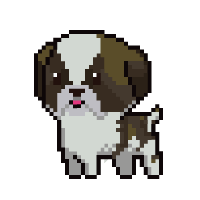

# Foundry NFT


1. An IPFS Hosted NFT 
2. An SVG NFT (Hosted 100% on-chain) 
<br/>
<p align="center">



</p>
<br/>


## Base64

To get the base64 of an image, you can use the following command:

```
echo "data:image/svg+xml;base64,$(base64 -i ./image/dynamicNft/happy.svg)"
```

Then, you can get the base64 encoding of the json object by placing the imageURI into `happy_image_uri.json` then running:

```
echo "data:application/json;base64,$(base64 -i ./image/dynamicNft/happy_image_uri.json)"
```
